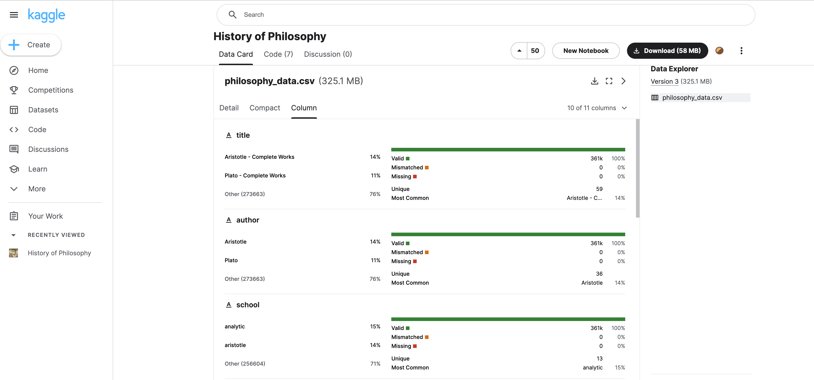

Name: Chenbohan Zhang
UID: cz2738@columbia.edu

# 1. Introduction

The "History of Philosophy" is built by Kourosh Alizadeh on Kaggle. It contains 300,000 sentences from over 50 text spanning 10 major schools of philosophy. 


# 2. Import Necessary Packages

```{r load libraries, warning=FALSE, message=FALSE, include=FALSE}
packages.used=as.list(
  c(
  "tidyverse",
  "haven",
  "devtools",
  "RColorBrewer",
  "data.table",
  "ggplot2",
  "forcats",
  "vcd",
  "gridExtra",
  "HH",
  "GGally",
  "readr",
  "knitr",
  "markdown",
  "here",
  "dplyr",
  "hcandersenr",
  "tidytext",
  "tokenizers",
  "stopwords")
)
check.pkg = function(x){
  if(!require(x, character.only=T)) install.packages(x, 
                                                     character.only=T,
                                                     dependence=T)
}
lapply(packages.used, check.pkg)
```


# 3. Access the Data from Kaggle

## Step 3.1: download the dataset

The entire dataset is posted at Kaggle's [website](https://www.kaggle.com/datasets/kouroshalizadeh/history-of-philosophy?select=philosophy_data.csv).

## Step 3.2: Assign your data with local path

```{r read in data, message = F}
library("haven")
df <- read_csv("../data/philosophy_data.csv")
```

Our df data set has `r nrow(df)` respondents and `r ncol(df)` variables.

Here's the head of our data set.

```{r}
head(df)
```


```{r}
col_name <- names(df)
print(col_name)
```
The columns are `r col_name`.

## Step 3.3: Cleaning Data Set

Kaggle has shown that no column are mismatched nor missing. The data set could be previously cleaned. So we can treat the original data set as a cleaned up version.



# Step 4: Analysis

## Step 4.1: What are the most popular school among all the time?

The intuitive is to find out the total amount of paper writtened by each school under each period.

### Step 4.1.1: Getting Necessary Columns and Process the Data

In order to answer the question, we should get the "title",  "school", and "original_publication_date" columns.

```{r}
df1 <- df %>% dplyr::select(title,school,original_publication_date)
head(df1)
```

After extracting the necessary columns, we should use group by to sum up all the papers. 

```{r}
df1_sum <- df1 %>% group_by(school,original_publication_date) %>% summarize(total_paper=n(),.groups = 'drop')
```

Now, we tried to plot a multi-line graph based on school and year.

```{r}
ggplot(data = df1_sum, aes(x=original_publication_date, y=total_paper,colour=school)) + geom_line() + labs(title="Total Paper of All Schools") 
```

Hold on, this doesn't look right!


### Step 4.1.2: Slicing Up Data Set and Shift Focus

On the table "Total Paper of All Schools" above, we can see all the data is so clustered around 1500-2000, except for Plato and Aristotle, which is the one the only around -350.

To dig further into our data set, we could only keep the data from 1500-2000 and see which school was famous that time.

```{r}
df1_sub =df1_sum[df1_sum$original_publication_date>=1500 & df1_sum$original_publication_date<=2000, ]

```

After subsetting, there are only few schools left. These are `r unique(df1_sub$school)`

We then plot a graph based on the above subsetted data set.

```{r}
ggplot(data = df1_sub, aes(x=original_publication_date, y=total_paper,colour=school)) + geom_line() + labs(title="Total Paper of All Schools from 1500 to 2000") 
```

### Step 4.1.3: Conclusion

From all above analysis, we could see that the most famous and ancient school of philosophy is Plato. And when time comes to around 1500, rationalism rose. 500 years later, around when we were born, philosophers tended to think analytically. 

## Step 4.2: What's the difference among all the famous schools of all the time?

### Step 4.2.1: Getting Necessary Columns

In order to answer question 4.2, we need column "school", original_publication_date", "sentence_length", "tokenized_txt".

```{r}
df2 <- df %>% dplyr::select(school,original_publication_date,sentence_length, tokenized_txt)
df2_sub <- df2[df2$school %in% c('plato','rationalism','analytic'),]
head(df2_sub)
```

### Step 4.2.2: Analysis on Sentence Length

Let's first look into the average length of one piece of work in each school, so that we might see the potential different style of writing among those schools.

```{r}
df2_avg <- df2_sub %>% group_by(school) %>% summarize(avg_length=mean(sentence_length),.groups = 'drop')

```
```{r}
p<-ggplot(data=df2_avg, aes(x=school, y=avg_length)) +
  geom_bar(stat="identity", fill="steelblue")+
  theme_minimal()

p
```

In the graph, we can see that there is no such huge difference between school analytic and plato, but in rationalism, there are 50 words more in every sentence on average. Rationalism is defined to regard reason as the chief source and test of knowledge. Rationalist believes the reality follows a intrinsically logical way. Thus, a relatively long structure of sentence could be due to their fully logical reasoning. 

